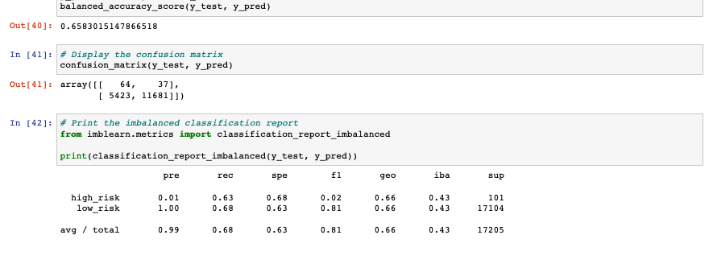

# Credit_Risk_Analysis

## Overview

The purpose of this analysis is to employ different machine learning techniques to train and evaluate models with unbalanced classes. Using the credit card credit dataset from LendingClub, a peer-to-peer lending services company, data is oversampled using the RandomOverSampler and SMOTE algorithms, and undersampled using the ClusterCentroids algorithm. A combinatorial of over- and undersampling is demonstrated in the SMOTEEN algorithm. Finally two machine learning models that reduce bias, BalancedRandomForestClassifier and EasyEnsembleClassifier, are used to predict credit risk.

## Results:

### Balanced accuracy scores and the precision and recall scores of all six machine learning models:

- RandomOverSampler balanced accuracy score 63, precision .99, recall .53

- EasyEnsembleClassifier balanced accuracy score 93, precision .99, recall .94

- SMOTE accuracy balanced score 65, precision .99, recall .68

- ClusterCentroids balanced accuracy score 65, precision .99, recall .68

- SMOTEEN balanced accuracy score 65, precision .99, recall .57

- BalancedRandomForestClassifier balanced accuracy score 76, precision .99, recall .88

- Easy Ensemble AdaBoost Classifier balanced accuracy score 93, precision .99, recall .94

## Summary: 
Summarize the results of the machine learning models, and include a recommendation on the model to use, if any. 
If you do not recommend any of the models, justify your reasoning.

There is a summary of the results (2 pt)
There is a recommendation on which model to use, or there is no recommendation with a justification (3 pt)

